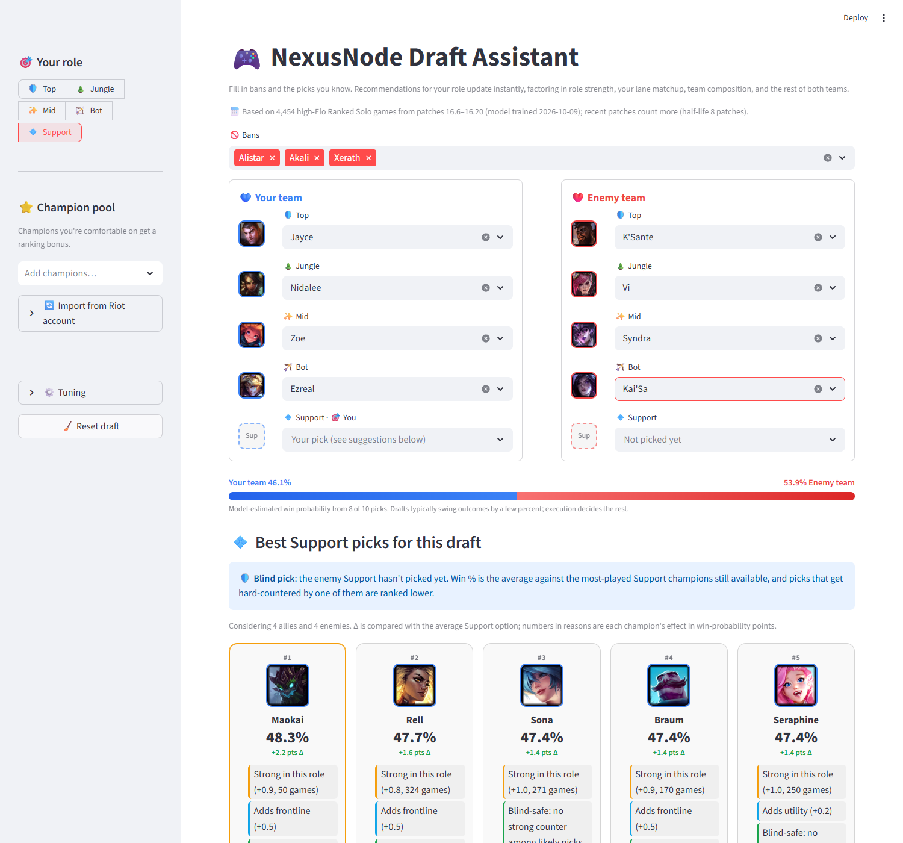
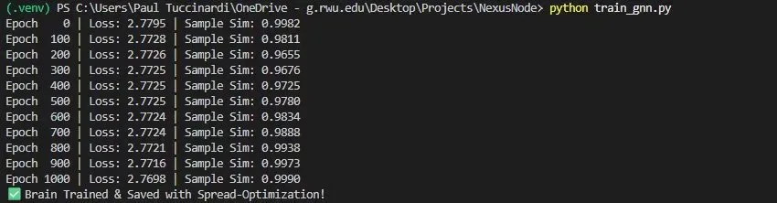

# NexusNode: GNN-Powered Tactical Drafting Engine
NexusNode is an automated MLOps pipeline and recommendation engine that uses Graph Neural Networks (GNN) to optimize team compositions in League of Legends. By analyzing high-Elo match data from multiple global regions, it maps champion synergies into a 64-dimensional vector space to provide real-time drafting intelligence.



---

## 💼 Business Impact & Problem Statement
### The Problem
In competitive MOBA games, the "Draft Phase" determines up to 60% of the match outcome. However, players and coaches often rely on static win-rate statistics or subjective "gut feelings." Traditional analytics fail to capture the latent synergies—the hidden mathematical relationships between champions that only emerge in high-level play.

### The Solution
NexusNode replaces static stats with a Dynamic Embedding Model. By treating champions as nodes, with edges for both teammates and opponents, the system learns which champions "belong together" **and** which ones beat each other, then recommends the pick that maximizes your team's predicted win probability against the actual enemy draft.

### Business Value
- Performance Optimization: Increases win probability by identifying non-obvious champion synergies.

- Scalability: Automated ETL pipelines handle global data (KR, NA, EUW, BR) without manual intervention.

- Personalization: Integrates Riot Games API to tailor recommendations to a specific player's "Comfort Pool" and mastery history.

---

## 🏗️ Technical Architecture
The project is structured as a modular MLOps Pipeline:

- Ingestion (collect_data.py): A weekly automated scraper of Ranked Solo/Duo games (queue 420 only) from the top Challenger and Grandmaster players across 4 regions (NA, EUW, KR, BR), newest matches first. Each game records its patch and date. Scale is set by environment variables (`PLAYERS_PER_TIER`, `MATCHES_PER_PLAYER`, `MAX_NEW_MATCHES_PER_REGION`, `RIOT_REQUEST_DELAY`). `python modules/collect_data.py --backfill` fills patch/date/queue for older rows.

- Transformation (eda.py): Keeps only verified Ranked Solo games, deduplicates, standardizes roles, and keeps only complete 5v5 drafts.

- Featurization (preprocess.py):

  - Builds per-champion stat features (StandardScaled) and a two-relation champion graph: **teammate (synergy)** edges and **opponent (counter)** edges.

  - Builds role eligibility (≥15% of a champion's games and ≥20 games in that role) and an observed lane-matchup table used as evidence in the UI.

- Learning (train_gnn.py):

  - **Role strength**: a per-(champion, role) term with a Gaussian prior, so small samples are shrunk toward average and a champion's main-role results don't leak into its off-roles.
  - **Team composition** (composition.py): class mix, AD/AP imbalance, and frontline for each team, from Data Dragon class tags and damage ratings, with an antisymmetric composition-vs-composition term.
  - **Relational GNN** (one GCN per relation) produces champion embeddings feeding ally-synergy (symmetric) and enemy-counter (antisymmetric, all 25 ally-vs-enemy pairs) bilinear terms, trained end-to-end on match outcomes.
  - **Lane matchup evidence**: observed head-to-head lane results, estimated as residuals against the model with sample-size shrinkage.
  - **Patch recency**: matches are weighted by `0.5 ** (patches_behind / 8)`, so the current meta dominates while older patches still contribute.

  Every component and setting is kept only if it improves log loss on the **newest** held-out matches (rolling time-based validation, averaged over seeds where effects are small). With the current data, cross-validation showed lane matchups are the only pairwise signal that generalizes. Observed cross-role counters and teammate synergy made predictions worse, and the GNN's interaction terms are regularized to near zero. They grow as more data arrives.

- Deployment (app.py, engine.py): A Streamlit draft assistant with champion portraits (Data Dragon), bans, a live win-probability bar, and ranked recommendations explained by role strength (with sample size), team composition, lane matchup records, and synergy/counters relative to the other options.

  - **Counter pick**: when your lane opponent is locked in, picks are scored directly against them.
  - **Blind pick**: otherwise, picks are scored against the 12 most-played champions still available for that role, and picks that one of them specifically counters (worse than other picks fare against it) are ranked lower and flagged ("Countered by Jayce").

---

## 🚀 Automation (CI/CD)
The project utilizes GitHub Actions to maintain model relevancy in the ever-shifting "League Meta":

Weekly Scrape & Retrain: Every Monday at 00:00 UTC, a headless runner:

- Scrapes up to 2,000 new high-Elo Ranked Solo matches (500 per region).

- Cleans and transforms the data.

- Retrains the draft model with recency weighting toward the newest patch.

- Commits the refreshed data and `data/processed/nexus_model.pt` back to the repository.

The scraper exits with an error if the Riot API key is missing or rejected, so an expired key fails the workflow visibly. Development keys expire every 24 hours; use a personal or production key for the `RIOT_KEY` repository secret.

---

## 🛠️ Installation & Usage
### Prerequisites
- Python 3.10+

- Riot Games API Key (Developer Portal)


1.  Setup

    Clone the repository:

    ```Bash
    git clone https://github.com/PTucc327/NexusNode.git
    cd NexusNode
    ```

2. Install dependencies:

    ```Bash
    pip install -r requirements.txt
    ```

3. Configure environment:
    Create a .env file in the root:

    ```
    RIOT_KEY=your_api_key_here
    ```

4. Run the application:

```Bash
streamlit run app.py
```

### Tests
The suite covers the engine's guarantees (swapping teams flips the prediction, bans are never recommended, blind/counter modes), the data pipeline, the UI end to end, the League client reader, and security guards (no API keys in tracked files, pinned dependencies and actions, XSRF protection on, no player identifiers stored). It runs on every push, and the weekly pipeline runs it on each new model before committing.

```Bash
pip install -r requirements-dev.txt
NEXUSNODE_OFFLINE=1 python -m pytest tests
```

### Deployment (container)
`requirements-app.txt` holds only what the app needs at runtime. The image runs as a non-root user, hides error details from visitors, keeps XSRF protection on, and never contains secrets: provide `RIOT_KEY` at runtime from your host's secrets manager.

```Bash
docker build -t nexusnode .
docker run -p 8501:8501 -e RIOT_KEY=... nexusnode
```

Per Riot's developer policies, register the product on the Developer Portal before any public launch.

### Desktop mode (League client sync, in development)
With `NEXUSNODE_DESKTOP=1`, the sidebar offers **Sync with champion select**, which fills in your role, both teams and bans from the League client running on your computer. It is read-only by construction: one allow-listed endpoint, only visible picks and bans are parsed (never player identities), and TLS is pinned to Riot's certificate authority. Riot requires League Client API use to be listed on the product's Developer Portal page and acknowledged **before** release, so this mode is for local development until then.

```Bash
NEXUSNODE_DESKTOP=1 streamlit run app.py
```
---

## 🧪 Model Performance
Trained on 4,454 Ranked Solo games from patches 16.6–16.20, 173 champions. Validated on the **newest 890 matches** (time-based split: trained on older games, tested on later ones, which is the honest test for "will this work next week"):

| Model | Log loss ↓ | AUC ↑ |
|---|---|---|
| **Full model + lane matchup evidence (shipped)** | **0.6900** | **0.539** |
| Full model, no lane evidence | 0.6906 | 0.534 |
| Without enemy terms (ablation) | 0.6916 | 0.523 |
| No draft information (side bias only) | 0.6926 | 0.500 |

- Hyperparameters, shrinkage strengths, recency half-life and the composition features were chosen by rolling time-based validation.
- Draft-only prediction is a low-signal problem (player skill and execution dominate at Challenger), so the model's job is to rank picks by a few points of win probability, not to call games. Pairwise effects (synergy, cross-lane counters) should become visible as the weekly pipeline grows the dataset.


---

## 👨‍💻 Author

Paul Tuccinardi – Data Scientist & ML Engineer

M.S. Data Science | Pace University

Philosophy: "Good, Better, Best" — iterative improvement through data.

*NexusNode isn't endorsed by Riot Games and doesn't reflect the views or opinions of Riot Games or anyone officially involved in producing or managing Riot Games properties. Riot Games, and all associated properties are trademarks or registered trademarks of Riot Games, Inc.*
